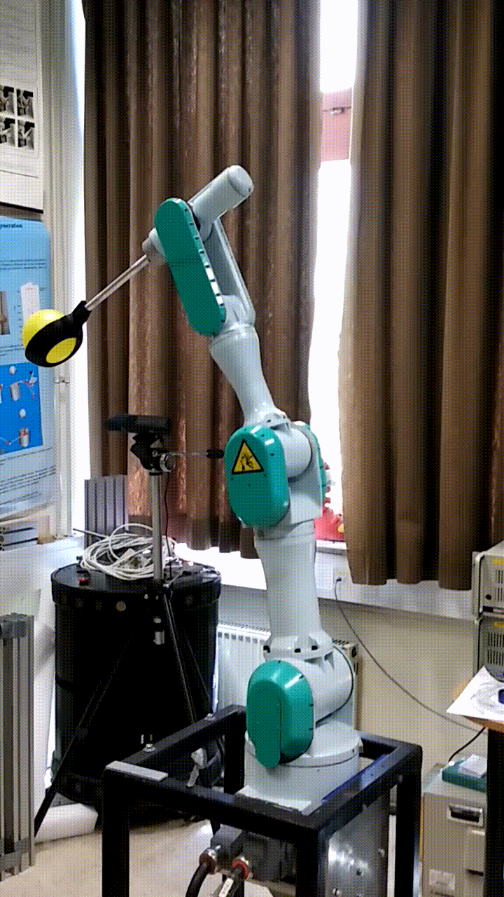
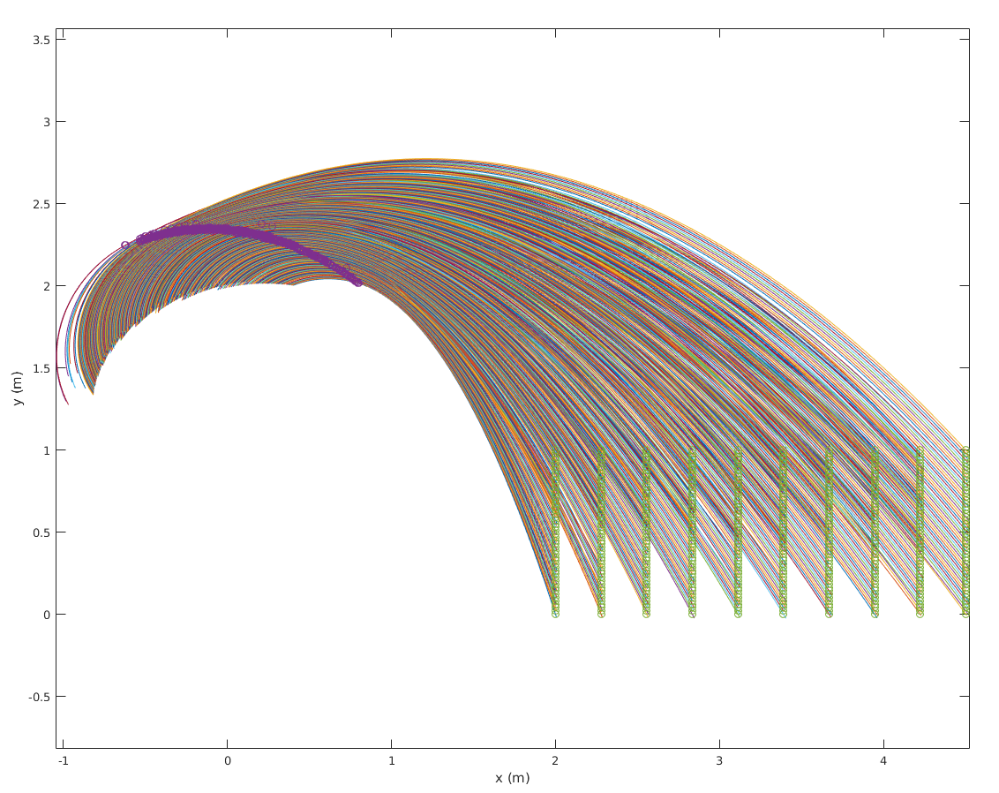
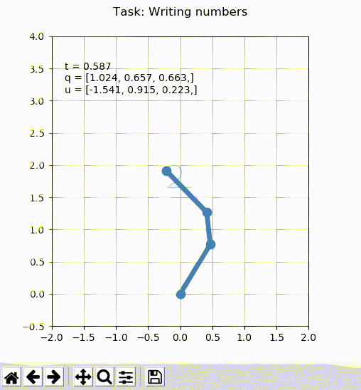
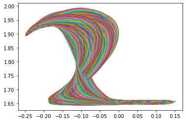
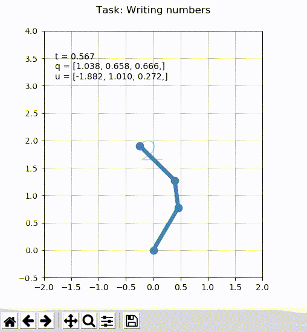

# latent-learning-robot
Deep autoencoder for robotic task learning in latent space

A simple deep autoencoder network designed to demonstrate applicability in robotic task learning. The robot's task was to accurately throw a ball into the target using reinforcement learning. Mitsubishi PA-10 robot was used for the execution of the throw. Demo:



The trajectories of motion of the robot were presented using dynamic movement primitives (DMP). To reduce the dimensionality we ran a reinforcement learning algorithm in the latent space of the deep autoencoder network.

Data set for training the autoencoder was generated in simulation. The data is a set of DMP weight vectors that define the appropriate robot movements that generate ball trajectories for a grid of targets:



Reinforcement learning was shown to be faster in the extracted latent space and it generated more natural movements of the robotic arm [1].


## How-to
The Python script train-ae.py in scripts directory trains the deep autoencoder network using DMP weight vectors in csv format (examples in data directory) and saves transition matrices for encoding and decoding to and from latent space. 

Reinforcement learning algorithm (PoWER) can then be applied to modify the transformed DMP weights in latent space of the initial throw to reach the target.

The simulation and execution was written in Matlab for this specific robot and this specific task. The same approach can be applied in general for different tasks.

### Example
We can apply the same approach for a simple task of writing numbers:



For implementation of DMPs we can use open source Python library: [pydmps](https://github.com/studywolf/pydmps)

```bash
pip install pydmps
```

For the simulation of a robotic arm we can use the simulation framework: [control](https://github.com/studywolf/control). First we need to generate a set of DMP weights vectors that define the appropriate robot movements that generate the numbers trajectories. The figure below is showing the set of generated trajectories for number 2:



Then train the deep autoencoder network to extract the latent space for learning. We can start with initial simple movement of drawing a line, transform the DMP weights into latent space and apply reinforcement learning algorithm to reach a target drawing of the number:



the euclidean distance between the generated curve and the target curve that represents the number was used as a reward function for PoWER reinforcement learning algorithm.


## References
[1]: R. Pahič, Z. Lončarević, A. Ude, B. Nemec and A. Gams, "User Feedback in Latent Space Robotic Skill Learning," 2018 IEEE-RAS 18th International Conference on Humanoid Robots (Humanoids), Beijing, China, 2018, pp. 270-276, doi: 10.1109/HUMANOIDS.2018.8624972.
[http://www.cs.columbia.edu/~allen/S19/learning_HITL_throwing_policy.pdf](http://www.cs.columbia.edu/~allen/S19/learning_HITL_throwing_policy.pdf)

